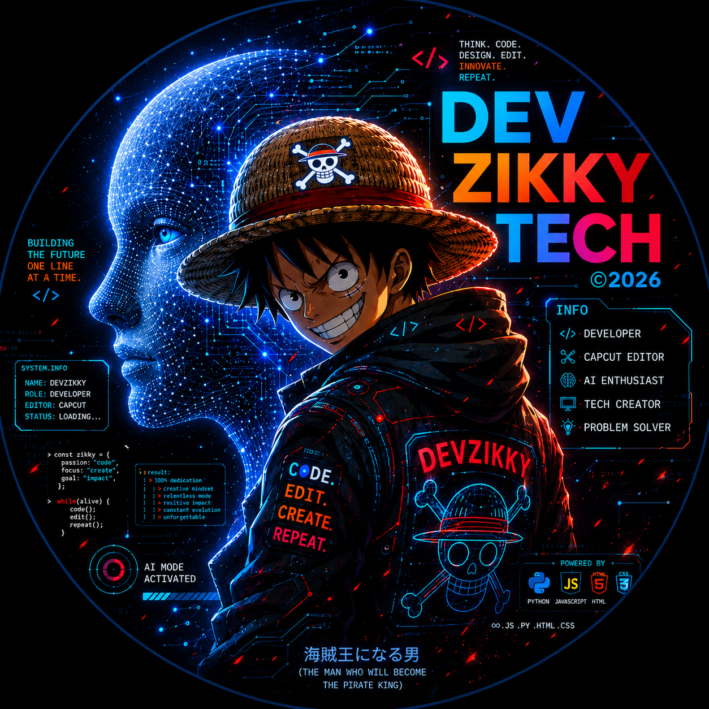

<div align="center">


[](https://github.com/zikky0001-droid)
[](https://zikkytech.xo.je)
[](https://devzikky.onrender.com)
[](https://opensource.org/license/mit)

<br/>

[](https://git.io/typing-svg)

<br/>



</div>

---

# 👋 About DEVZIKKY

<div align="center">

[](https://git.io/typing-svg)

</div>

I'm a tech enthusiast, builder, and problem-solver focused on turning ideas into working products.

My work spans:

- 🤖 AI assistants and AI-powered applications
- 🌐 Full-stack web development
- 🔌 REST and GraphQL APIs
- 📱 WhatsApp and Telegram bots
- 📧 Temporary/disposable email infrastructure
- 📚 Manga and content-focused web tools
- 🧰 Developer utilities and automation
- ☁️ Deployment, APIs, databases, and backend systems
- 🎨 Responsive interfaces and interactive UI
- 🔐 API authentication, tokens, sessions, and rate limiting
- 📟 Android/Termux-based development workflows

> **Build the idea. Make it work. Then keep making it better.**

---

# 🛠️ Tech Stack

<div align="center">


</div>

---

# 📟 Terminal

<div align="center">

```text
┌─[devzikky@tech]─[~]
└──╼ $ whoami

  DEV ZIKKY
  Developer · Builder · Problem Solver
  DEVZIKKY TECH · Nigeria

┌─[devzikky@tech]─[~]
└──╼ $ cat focus.txt

  AI
  Full-Stack Development
  APIs
  WhatsApp & Telegram Bots
  Developer Tools
  Automation

┌─[devzikky@tech]─[~]
└──╼ $ ls ./projects

  DEVZIKKY AI
  ZIKKY AI
  ZMAIL Studio
  ZMAIL Drop
  ZDropMail
  ZIKKY Manga Hub
  ZQUOTE
  DEVZIKKY TECH

┌─[devzikky@tech]─[~]
└──╼ $ environment

  Android · Termux · GitHub
  Vercel · Render · Netlify
  Supabase · Firebase

┌─[devzikky@tech]─[~]
└──╼ $ status

  Building.
  Testing.
  Deploying.
  Learning.
  Repeating.

┌─[devzikky@tech]─[~]
└──╼ $ █
```

</div>

---

# 🚀 Featured Projects

## 🤖 DEVZIKKY AI

A developer-focused AI assistant built by DEV ZIKKY TECH.

It provides a dedicated interface for technical questions, debugging, programming help, project ideas, explanations, and development workflows.

🌐 **Live:** https://devzikky.onrender.com  
💻 **Source:** https://github.com/zikky0001-droid/devzikky

---

## 🧠 ZIKKY AI

An AI-focused project in the DEVZIKKY ecosystem, built around experimentation with AI assistants, models, prompts, APIs, and developer workflows.

---

## 📧 ZMAIL Studio

A developer-oriented email platform and API ecosystem focused on temporary email workflows, developer tooling, API access, templates, and integrations.

---

## 📬 ZMAIL Drop

A temporary email/web inbox project built and maintained as part of the DEVZIKKY ecosystem.

🌐 **Live:** https://zmaildrop.vercel.app

---

## 📥 ZDropMail

An experimental developer-focused disposable email workflow exploring session-based inboxes, GraphQL APIs, messages, attachments, and email automation.

---

## 📚 ZIKKY Manga Hub

A manga-focused web project built as part of the broader DEVZIKKY collection of internet tools.

---

## 🖼️ ZQUOTE

A quote/sticker generation project designed around creating shareable, Telegram-style quote graphics.

---

## 🌐 DEVZIKKY TECH

The home of the DEVZIKKY developer identity, projects, experiments, tools, and portfolio.

🌐 https://zikkytech.xo.je

---

# 🧩 Skills & Areas

<div align="center">

| Category | Technologies / Skills |
|---|---|
| Languages | JavaScript · Python · HTML · CSS |
| Backend | Node.js · Express.js |
| APIs | REST · GraphQL · API Authentication |
| AI | AI/LLMs · Prompt Engineering · Model Orchestration |
| Bots | WhatsApp Bots · Telegram Bots |
| Databases | Supabase · Firebase · Cloud Firestore |
| Frontend | Responsive UI · CSS Animations · Canvas |
| DevOps | Vercel · Render · Netlify · InfinityFree |
| Workflow | Git · GitHub · cURL · CLI · Termux |
| Architecture | Sessions · Rate Limiting · API Gateways |
| Other | Web Scraping · Automation · Custom Domains |

</div>

---

# 🤖 AI & Automation

AI is one of the main areas I experiment with.

Things I work with include:

- AI chat interfaces
- Multiple AI providers/models
- Prompt engineering
- Model routing and fallback systems
- AI-powered bots
- Vision/image analysis
- TTS and voice AI
- API-based AI integrations
- Context-aware assistants
- Developer-focused AI tools

The goal isn't simply to connect an AI API.

The goal is to turn AI into something **actually useful inside a product**.

---

# 📱 Android + Termux Workflow

A big part of my development workflow is Android-first.

With a phone, Termux, Git, Node.js, Python, APIs, and a browser, I can:

```text
Code
  ↓
Test
  ↓
Debug
  ↓
Git commit
  ↓
Deploy
  ↓
Monitor
  ↓
Fix
  ↓
Repeat
```

The device doesn't have to be a limitation.

Sometimes it becomes the entire development environment.

---

# 📊 GitHub Stats

<br/>

<div align="center">


</div>

# 🐍 Contribution Snake

<div align="center">


</div>

> The snake requires a GitHub Actions workflow that generates the `output` branch/file. If it isn't configured yet, this image will not appear until that workflow exists.

---

# 🧪 Currently Building

<div align="center">

```text
╭────────────────────────────────────────────╮
│              DEVZIKKY STATUS               │
├────────────────────────────────────────────┤
│                                            │
│  [✓] Building AI tools                    │
│  [✓] Building web applications            │
│  [✓] Experimenting with APIs              │
│  [✓] Building bots                        │
│  [✓] Exploring automation                 │
│  [✓] Learning new technologies             │
│  [→] Shipping the next idea               │
│                                            │
╰────────────────────────────────────────────╯
```

</div>

---

# 🌍 Open Source

A major part of DEVZIKKY is experimentation in public.

The projects in this ecosystem explore ideas around AI, APIs, automation, web development, bots, developer utilities, and internet tools.

Repositories can be studied, forked, modified, and adapted according to their individual licenses.

---

# 🧠 Developer Mindset

```text
Think → Build → Test → Break → Debug → Improve → Ship
```

I don't expect every first version to be perfect.

The important part is getting the idea into a working state, learning from what breaks, and continuing to improve it.

---

# 🔥 DEVZIKKY Philosophy

> Build things people can actually use.

> Learn by building.

> Don't wait for the perfect setup.

> If the idea is worth exploring, prototype it.

> Ship. Learn. Improve.

---

# 🤝 Collaboration

Interested in:

- Open-source projects
- AI experiments
- Bot development
- API projects
- Web applications
- Developer tools
- Interesting technical experiments

Feel free to connect through GitHub or the DEVZIKKY TECH portfolio.

---

# 🔗 Connect

<div align="center">

[](https://github.com/zikky0001-droid)

[](https://zikkytech.xo.je)

[](https://devzikky.onrender.com)

[](https://zmaildrop.vercel.app)

</div>

---

# ⚡ One More Thing

<div align="center">

[](https://git.io/typing-svg)

</div>

---

<div align="center">


<br/><br/>


### DEVZIKKY

**DEV ZIKKY TECH · Nigeria**

[](https://github.com/zikky0001-droid)

</div>
